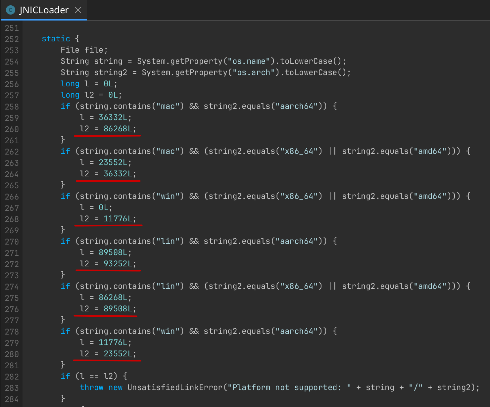

# JnicX

A tool to extract native shared libraries (`.so`, `.dll`, `.dylib`) from the compressed binary used by JNIC-protected applications.

## Requirements

- Java 17 or higher
- Maven (for building from source)

## Building

```bash
mvn clean package
```

## Usage

```bash
java -jar jnicx.jar <input-file> [<platform-name> <start-offset> <end-offset>]..
```

### Arguments

| Argument | Description |
|----------|-------------|
| `<input-file>` | Path to the JNIC binary bundle file |
| `<platform-name>` | Name identifier for the platform (e.g., `linux-x64`, `windows-x64`, `macos-arm64`) |
| `<start-offset>` | Starting byte offset of the platform binary within the bundle |
| `<end-offset>` | Ending byte offset of the platform binary within the bundle |

You can specify multiple platforms by repeating the `<platform-name> <start-offset> <end-offset>` triplet.

> **Note:** The byte offsets currently need to be found manually by the user (use Recaf). Automatic offset detection is planned but may not work on obfuscated inputs.

### Examples

```bash
# Extract a single platform binary
java -jar jnicx. jar native.bin linux-x64 23552 36332

# Extract multiple platform binaries  
java -jar jnicx.jar native.bin linux-x64 23552 36332 windows-x64 0 11776 macos-arm64 36332 86268
```

### How to Find the Offsets

1. **Locate the JNICLoader class file**  
   This is typically found at: `dev/jnic/<random>/JNICLoader.class`

2. **Decompile the class**  
   Use a Java decompiler (such as those bundled in [Recaf](https://github.com/Col-E/Recaf)), to decompile the class file.

3. **Find the offsets in the `<clinit>` method**  
   The offsets for each platform are located in the static class initializer (`<clinit>`). Look for a pattern similar to the example below, where `l` is the start offset and `l2` is the end offset:

   

> **⚠️ Note:** This process may vary significantly if the input JAR has been obfuscated.


## License

This project is licensed under the **GNU General Public License v3.0** - see the [LICENSE](LICENSE) file for details.
